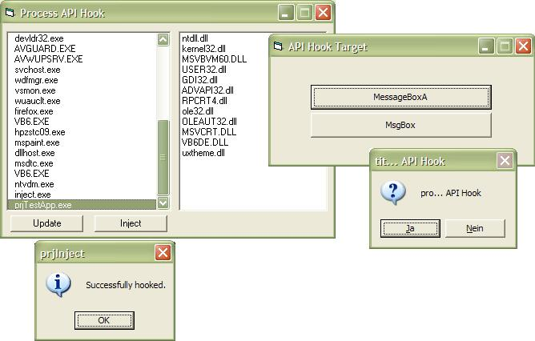



## process injection/API hooking

### Description

This shows you 2 API hooking techniques. IAT hooking and function redirecting, also how to inject your code into another VB process and hook a function remotely. Thanks to Ion Ion Alex Ionescu for his injection demo. It's important that you read the readme in the "inject" directory.
 
### More Info
 

             |
---                |---
**Submitted On**   |2005-08-26 16:33:36
**By**             |[Arne Elster](https://github.com/Planet-Source-Code/PSCIndex/blob/master/ByAuthor/arne-elster.md)
**Level**          |Advanced
**User Rating**    |5.0 (40 globes from 8 users)
**Compatibility**  |VB 6\.0
**Category**       |[Miscellaneous](https://github.com/Planet-Source-Code/PSCIndex/blob/master/ByCategory/miscellaneous__1-1.md)
**World**          |[Visual Basic](https://github.com/Planet-Source-Code/PSCIndex/blob/master/ByWorld/visual-basic.md)
**Archive File**   |[process\_in1927708262005\.zip](https://github.com/Planet-Source-Code/arne-elster-process-injection-api-hooking__1-62338/archive/master.zip)

